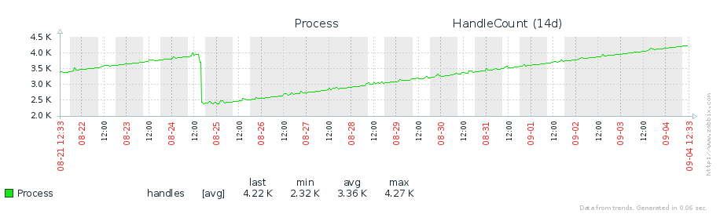

# О проблеме

Начну с вопроса — есть ли в Вашем проекте требования к максимальному расходу памяти, количеству открываемых одновременно файлов и хендлов, загрузки процессора, использования дискового пространства? В случае ответа — нет, смысла что-то читать далее нет. В случае ответа — да, следующий вопрос — а Ваш конечный код (не на этапе разработки и тестирования, а у `каждого` клиента) вообще имеет какие-нибудь рецепторы на эти требования? Если такого нет, то как можно говорить об «ответственности перед клиентом» за свои обещания по проценту загрузки процессора, объему потребленной памяти и загрузки дисковой подсистемы.

Простой тест на устойчивость продукта к DDoS — она прямо пропорциональна использованию семафоров в Вашем проекте (посчитайте сколько их у Вас).

## О велосипедах

Где-то вы забыли закрыть хендл, где-то не освободили память (или за Вас это сделала сторонняя библиотека) … в целом проблем у программиста на c (c++ в большей степени) хватает.

Для юземодного приложения, есть AppVerifier, он за утечками памяти не следит, Debug CRT + использование Debug Heap Alloc Map (делает обертки вокруг HeapAlloc …), но прямые вызовы api алокации памяти не видит и не подходит для си, да и бесполезна в случае использования сторонних уже собранных .lib

Для ядра - driver verifier прекрасно следит за утечками памяти, на этапе разработки, однако он ничего не знает о Ваших требованиях к использованию ресурсов. А Static Driver Verifier  проверяет только этап сборки, и не все может поймать.

## О проекте
Ну проект это громко сказано, хотя все возможно...
На текущем этапе это вспомогательный незавершенный проект (основной функционал в папке libs), для программистов, на сейчас может быть использован:
  * для контроля утечек, ликов ресурсов (я использовал для длительного мониторинга утечек (несколько суток));
  * для мониторинга лимитов использования ресурсов — на соответствие требованиям;
  * для быстрого поиска виновников утечек (как вживую, так и по дампу).


Весь вывод информации на сейчас идет в windbg или dbgview, хотя учитывая, что проект для программистов - можно допилить к заббиксу или WMI.



## Использование

Лучше 1 раз увидеть, чем 100 раз услышать — TODO: видео

В виде `resmon_client.exe` (использует resmon.dll), запускаем `resmon_client.exe <monitoring file.exe>`, по завершению последнего получим статистику.

В виде исходников или уже собранных  библиотек resmon.lib общая для ядра и юзермода + kmode.lib или umode.lib ну и resmonlib.h

В виде resmon_driver.sys — переименовываем его в нужный Вам драйвер, а к имени Вашего драйвера добавляем .check (к примеру veracrypt-x64.sys и veracrypt-x64.sys.check). При выгрузке драйвера в логи попадет статистика ликов если есть. PS: не забываем про тестовый режим или подписываем  resmon_driver.sys

В виде resmon.dll – в своем проекте в виде обертки над main или winmain
```c
int WINAPI wWinMainCheck (HINSTANCE hInstance, HINSTANCE hPrevInstance, wchar_t *lpszCommandLine, int nCmdShow)
{
...
}

int WINAPI wWinMain (HINSTANCE hInstance, HINSTANCE hPrevInstance, wchar_t *lpszCommandLine, int nCmdShow)
{
HMODULE dll = LoadLibrary(_T("resmon.dll"));
#pragma warning(push)
#pragma warning(disable: 4229)
void (* install)(void) = (void (*)(void))GetProcAddress(dll, "InstallResMon");
void (* uninstall)(void) = (void (*)(void))GetProcAddress(dll, "UninstallResMon");
void (* logres)(void) = (void (*)(void))GetProcAddress(dll, "LogAllResources");
#pragma warning(pop)

install();

int res = wWinMainCheck (hInstance, hPrevInstance, lpszCommandLine, nCmdShow);

uninstall();
return res;
}
```
при завершении работы приложения в логи попадает статистика ликов.

По лимитам - они не выставлены оптимально:
```c
//------------------------------------------------------------------------------
// defaults resmonitoring values
//------------------------------------------------------------------------------
#define MON_MAXIMUM_DISK_USAGE (1024*1024*128)            // 128 mb
#define MON_MAXIMUM_CPU_USAGE 30                          // 30%
#define MON_MAXIMUM_MEMORY_USAGE (1024*1024*128)          // 128 mb
#define MON_MAXIMUM_THREAD_USAGE (100-1)                  // 100
#define MON_MAXIMUM_SYNCHRONIZATION_OBJECT_USAGE (180-1)  // 180
#define MON_DEFAULT_RES_MONITORING_INTERVAL 5000          // 5 sec
```
2 параметра `MON_DEFAULT_RES_MONITORING_INTERVAL` и `MON_MAXIMUM_CPU_USAGE` тесно связаны, грамотным будет требование, например, программа не должна загружать cpu на более чем 30% в течение 5 мин. Меньшее чем 5 мин время в MON_DEFAULT_RES_MONITORING_INTERVAL большого смысла не имеет - пиково на 1-2-5 сек вполне можно грузить cpu, а вот если в течение 5 мин постоянная загрузка cpu будет - на такой машине все ползать будет. В большинстве реальных случаев лучше выбирать MON_DEFAULT_RES_MONITORING_INTERVAL около 5 мин, а не 5 сек.

## Пример

В качестве примера в файле `\tests\kernelmode\main.c` закоментируем `ZwClose(eventHandleZw);`, в дибажной сборке на assert'е найдем где хендл открывали по сохранненому `returnAddress 0xFFFFF8004F4231F5`:


В данном случае не наглядно, но `allocations detail` таблица размера кусков и частоты использования, позволяет оптимизировать собственный менеджер выделения памяти в случае параллельного программирования (хотя это уж очень специфическая задача).

Пример хорошо написанного приложения `resmon_client.exe notepad.exe`:
```
[2540] notepad.exe|resmon| threads used 2, sync object used 0, memory used 0
[2540] notepad.exe|resmon| threads used 2, sync object used 0, memory used 24
[2540] notepad.exe|resmon| =========== CHECK UNRELEASED RESOUCRES ============
[2540] notepad.exe|resmon| ------------ resmon memory usage 0 ----------------
[2540] notepad.exe|resmon| ------------------ memory usage 0 -----------------
[2540] notepad.exe|resmon| ------------------ thread usage 0 -----------------
[2540] notepad.exe|resmon| --------------- sync object usage 0 ---------------
[2540] notepad.exe|resmon| -------------------- allocations detail ----------------------------
[2540] notepad.exe|resmon| | size range                            | total allocs
[2540] notepad.exe|resmon| |0x0000000000000000 - 0x0000000000000010| 0x0000000000000005(5)
[2540] notepad.exe|resmon| |0x0000000000000010 - 0x0000000000000020| 0x0000000000000001(1)
[2540] notepad.exe|resmon| |0x0000000000000020 - 0x0000000000000040| 0x0000000000000004(4)
[2540] notepad.exe|resmon| |0x0000000000000040 - 0x0000000000000080| 0x0000000000000001(1)
[2540] notepad.exe|resmon| |0x0000000000000080 - 0x0000000000000100| 0x0000000000000004(4)
[2540] notepad.exe|resmon| |0x0000000000000100 - 0x0000000000000200| 0x0000000000000005(5)
[2540] notepad.exe|resmon| |0x0000000000000200 - 0x0000000000000400| 0x0000000000000001(1)
[2540] notepad.exe|resmon| --------------------------------------------------------------------
[2540] notepad.exe|resmon| ===================================================
```
Пример утечек ресурсов resmon_client.exe "С:\projects\VeraCrypt\build\Release\x64\bin\Setup Files\VeraCrypt-x64.exe":
```
[9308] VeraCrypt-x64.exe|resmon| =========== CHECK UNRELEASED RESOUCRES ============
[9308] VeraCrypt-x64.exe|resmon| ------------ resmon memory usage 8768 ----------------
[9308] VeraCrypt-x64.exe|resmon| ------------------ memory usage 1291073 -----------------
[9308] VeraCrypt-x64.exe|resmon| base 0x00000284B86B3670 size 144 tag 00000284B86B0000 (Heap)
[9308] VeraCrypt-x64.exe|resmon| created by [8632] thread
[9308] VeraCrypt-x64.exe|resmon| returnAddress 0x00007FF6C2A9F6F7
[9308] VeraCrypt-x64.exe|resmon| ---------------------------------------------------
...
[9308] VeraCrypt-x64.exe|resmon| ---------------------------------------------------
[9308] VeraCrypt-x64.exe|resmon| base 0x00000284B86C6420 size 62 tag 00000284B86B0000 (Heap)
[9308] VeraCrypt-x64.exe|resmon| created by [8632] thread
[9308] VeraCrypt-x64.exe|resmon| returnAddress 0x00007FF6C2A9F6F7
[9308] VeraCrypt-x64.exe|resmon| ---------------------------------------------------
[9308] VeraCrypt-x64.exe|resmon| ------------------ thread usage 8 -----------------
[9308] VeraCrypt-x64.exe|resmon| handle(ptr) 0x00000000000004FC id 6472
[9308] VeraCrypt-x64.exe|resmon| start address 0x00007FF6C2A86C2C
[9308] VeraCrypt-x64.exe|resmon| thread create time 0x0
[9308] VeraCrypt-x64.exe|resmon| thread exit time 0x0
[9308] VeraCrypt-x64.exe|resmon| thread [6472] used 0% cpu (kernel 0%, user 0%)
[9308] VeraCrypt-x64.exe|resmon| created by [8632] thread
[9308] VeraCrypt-x64.exe|resmon| returnAddress 0x00007FF6C2A86EFB
...
[9308] VeraCrypt-x64.exe|resmon| ---------------------------------------------------
[9308] VeraCrypt-x64.exe|resmon| handle(ptr) 0x0000000000000510 id 2496
[9308] VeraCrypt-x64.exe|resmon| start address 0x00007FF6C2A86C2C
[9308] VeraCrypt-x64.exe|resmon| thread create time 0x0
[9308] VeraCrypt-x64.exe|resmon| thread exit time 0x0
[9308] VeraCrypt-x64.exe|resmon| thread [2496] used 0% cpu (kernel 0%, user 0%)
[9308] VeraCrypt-x64.exe|resmon| created by [8632] thread
[9308] VeraCrypt-x64.exe|resmon| returnAddress 0x00007FF6C2A86EFB
[9308] VeraCrypt-x64.exe|resmon| ---------------------------------------------------
[9308] VeraCrypt-x64.exe|resmon| --------------- sync object usage 0 ---------------
[9308] VeraCrypt-x64.exe|resmon| -------------------- allocations detail ----------------------------
[9308] VeraCrypt-x64.exe|resmon| | size range                            | total allocs
[9308] VeraCrypt-x64.exe|resmon| |0x0000000000000000 - 0x0000000000000010| 0x00000000000000A5(165)
[9308] VeraCrypt-x64.exe|resmon| |0x0000000000000010 - 0x0000000000000020| 0x000000000000045F(1119)
[9308] VeraCrypt-x64.exe|resmon| |0x0000000000000020 - 0x0000000000000040| 0x000000000000036F(879)
[9308] VeraCrypt-x64.exe|resmon| |0x0000000000000040 - 0x0000000000000080| 0x0000000000000618(1560)
[9308] VeraCrypt-x64.exe|resmon| |0x0000000000000080 - 0x0000000000000100| 0x0000000000000061(97)
[9308] VeraCrypt-x64.exe|resmon| |0x0000000000000100 - 0x0000000000000200| 0x0000000000000013(19)
[9308] VeraCrypt-x64.exe|resmon| |0x0000000000000200 - 0x0000000000000400| 0x0000000000000012(18)
[9308] VeraCrypt-x64.exe|resmon| |0x0000000000000400 - 0x0000000000000800| 0x000000000000000C(12)
[9308] VeraCrypt-x64.exe|resmon| |0x0000000000000800 - 0x0000000000001000| 0x0000000000000001(1)
[9308] VeraCrypt-x64.exe|resmon| |0x0000000000001000 - 0x0000000000002000| 0x0000000000000004(4)
[9308] VeraCrypt-x64.exe|resmon| |0x0000000000002000 - 0x0000000000004000| 0x0000000000000002(2)
[9308] VeraCrypt-x64.exe|resmon| |0x0000000000040000 - 0x0000000000080000| 0x0000000000000002(2)
[9308] VeraCrypt-x64.exe|resmon| |0x0000000000080000 - 0x0000000000100000| 0x0000000000000001(1)
[9308] VeraCrypt-x64.exe|resmon| --------------------------------------------------------------------
[9308] VeraCrypt-x64.exe|resmon| error ... not all resources free
[9308] VeraCrypt-x64.exe|resmon| ===================================================
```
В данном случае `resmon memory usage 8768` для мониторинга ресурсов resmon использует память и ее тоже учитывает, кода ресурсов нет, эта память тоже не выделяется.

## Планы

Захват, освобождение объектов синхронизации, файлы, больше охват вариантов текущих апи (на сейчас мониторится далеко не все).

Логирование. 

Избирательный мониторинг (только хендлы, только память и т.п.). Больше параллельности в работе.
